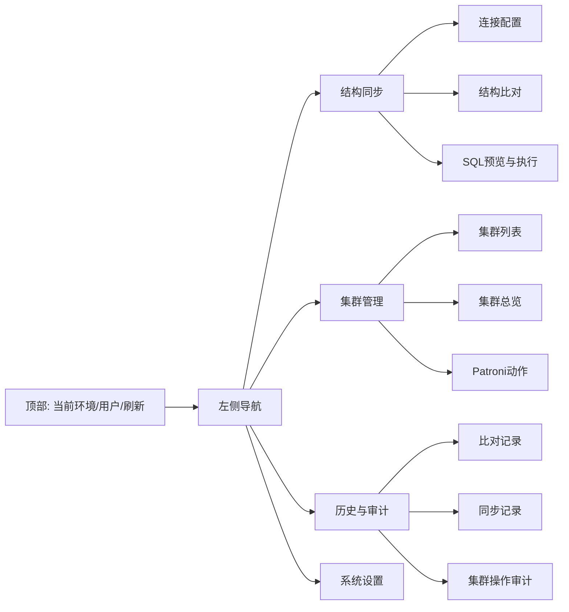
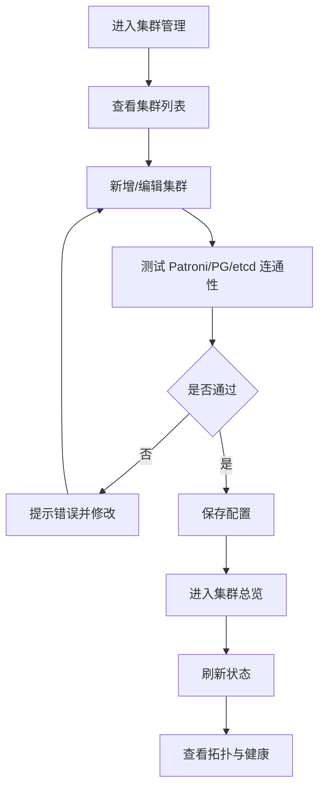
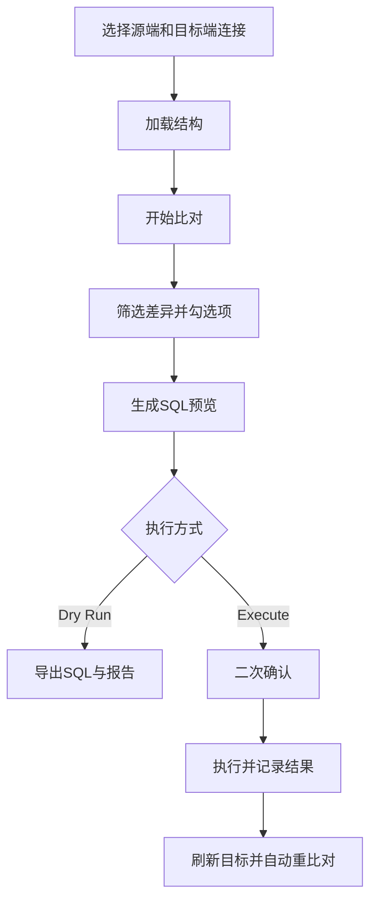

# 数据库结构同步客户端 轻量改版原型图（含 PostgreSQL 集群管理）

日期：2026-04-14
定位：在现有客户端基础上做轻量升级，不做重平台化重构。

## 1. 设计目标（轻量）

1. 保留现有“连接配置 + 结构比对 + SQL 预览 + 同步执行 + 历史记录”主流程。
2. 新增“PostgreSQL 集群管理”能力，先做接入与只读总览，再加最小动作入口。
3. 统一信息架构，减少入口分散和流程跳转成本。
4. 控制开发复杂度：优先复用现有主窗口、对话框、线程模型与本地 SQLite。

## 2. 新版信息架构（IA）原型图



## 3. 页面原型图

## 3.1 主框架（新增左侧导航）

```text
+----------------------------------------------------------------------------------+
| 数据库结构同步客户端                                  [环境:PROD] [刷新] [退出] |
+----------------------+-----------------------------------------------------------+
| 左侧导航             | 右侧工作区                                                |
|                      |                                                           |
| [结构同步]           | 依据左侧菜单加载对应页面                                  |
|   - 连接配置         |                                                           |
|   - 结构比对         |                                                           |
|   - SQL预览/执行     |                                                           |
|                      |                                                           |
| [PostgreSQL集群管理] |                                                           |
|   - 集群列表         |                                                           |
|   - 集群总览         |                                                           |
|   - Patroni动作      |                                                           |
|                      |                                                           |
| [历史与审计]         |                                                           |
| [系统设置]           |                                                           |
+----------------------+-----------------------------------------------------------+
| 状态栏: 最近操作结果 / 后台任务进度                                             |
+----------------------------------------------------------------------------------+
```

设计说明：
1. 保持当前单窗口模型，不引入多窗口复杂度。
2. 结构同步作为一级模块保留，降低已有用户认知迁移成本。
3. 集群管理与结构同步并列，减少“配置在弹窗、功能在主界面”的割裂感。

## 3.2 PostgreSQL 集群列表页（新增）

```text
+----------------------------------------------------------------------------------+
| PostgreSQL集群管理 / 集群列表                                      [+新增集群]    |
+----------------------------------------------------------------------------------+
| 筛选: [环境▼] [关键字:________] [仅启用☑]                         [刷新]          |
+----+-------------+--------+----------------------+----------+---------+-----------+
| ID | 集群名称    | 环境   | Patroni端点数量      | PG连接    | 状态     | 操作      |
+----+-------------+--------+----------------------+----------+---------+-----------+
| 1  | HIS-PROD    | PROD   | 3                    | 已配置    | 健康     | 详情 编辑 |
| 2  | HIS-UAT     | UAT    | 3                    | 已配置    | 告警     | 详情 编辑 |
+----+-------------+--------+----------------------+----------+---------+-----------+
```

新增/编辑集群弹窗（轻量字段）：
1. 基础信息：集群名称、环境、说明。
2. Patroni：多个 API 地址（逗号分隔即可）。
3. PostgreSQL 管理连接：host/port/db/user/password。
4. etcd endpoint 列表（逗号分隔）。
5. 按钮：测试连接、保存。

## 3.3 集群总览页（新增，先只读）

```text
+----------------------------------------------------------------------------------+
| 集群总览 / HIS-PROD                                                 [手动刷新]    |
+----------------------------------------------------------------------------------+
| 卡片区                                                                          |
| [Primary: pg01] [Replica: 2] [Patroni: 3/3] [etcd: 3/3] [PG连接: 120 活跃: 18] |
+----------------------------------------------------------------------------------+
| 拓扑摘要（简版）                                                                 |
|   pg01 (Primary) ---- streaming ----> pg02 (Replica)                            |
|   pg01 (Primary) ---- streaming ----> pg03 (Replica)                            |
+----------------------------------------------------------------------------------+
| 节点明细                                                                          |
| 节点 | 角色 | 状态 | timeline | lag | pending_restart | last_seen               |
+----------------------------------------------------------------------------------+
| 最近操作（审计摘要）                                                              |
| 时间 | 操作人 | 动作 | 结果 | 详情                                               |
+----------------------------------------------------------------------------------+
```

说明：
1. 先文本+表格展示，不强制图形化拓扑组件。
2. 统一“健康/告警/失败”状态色，和现有比对状态体系保持一致风格。

## 3.4 结构同步页（原有能力重排）

```text
+----------------------------------------------------------------------------------+
| 结构同步 / 结构比对                                               [开始比对]      |
+----------------------------------------------------------------------------------+
| 源连接 [下拉]   目标连接 [下拉]   Schema筛选 [____]   对象筛选 [____] [刷新结构] |
+----------------------------------------------------------------------------------+
| 源端结构树（可勾选）                  | 目标端结构树（镜像勾选，灰态不可改）      |
|                                       |                                           |
+----------------------------------------------------------------------------------+
| 差异筛选: [对象类型▼] [分类▼] [只看可同步☐] [忽略仅目标端☐]                     |
+----------------------------------------------------------------------------------+
| 差异结果树（沿用现有可勾选项）                                                      |
+----------------------------------------------------------------------------------+
| 已选: x项   [生成SQL] [Dry Run] [执行同步] [导出报告]                             |
+----------------------------------------------------------------------------------+
```

重排重点：
1. 将“连接配置”从工具栏动作变为结构同步页内入口按钮，减少模式切换。
2. 差异筛选条保留现有能力，但视觉层次简化（筛选一行、操作一行）。
3. 状态提示固定在顶部，避免内容跳动。

## 4. 关键交互流程原型图

### 4.1 集群管理核心流程



### 4.2 结构同步核心流程（保留）



## 5. 轻量实施建议（对应原型）

1. 第一批：先做页面结构改版
- 主窗口加入左侧导航与页面容器。
- 原比对页面迁移为“结构同步”子页，保持逻辑基本不动。

2. 第二批：做集群管理最小闭环
- 集群列表 + 集群编辑弹窗 + 总览只读页。
- 数据先落本地 SQLite，先不接复杂权限。

3. 第三批：补最小动作与审计
- 新增 Patroni switchover/reload（带确认）。
- 操作日志落审计表并在“历史与审计”可查。

## 6. 非目标（当前版本不做）

1. 慢 SQL 与 csvlog 采集。
2. SSH 托管运维。
3. HAProxy/Keepalived 可视化。
4. 多角色复杂权限系统。

---

这版原型重点是“少改动、可落地、对现有用户迁移成本低”。
如果确认方向，可继续输出下一版：按页面拆解到字段级与按钮行为级（可直接转开发任务）。

## 7. 页面级任务拆解（到按钮行为级）

说明：以下任务按“页面 -> 区块 -> 按钮/动作 -> 行为规则 -> 完成标准”组织，可直接用于 Jira/禅道拆卡。

### 7.1 主框架页（导航容器）

任务 1：新增左侧导航容器
1. 范围：主窗口增加左侧导航、右侧页面栈、顶部全局工具区。
2. 入口按钮：结构同步、集群管理、历史与审计、系统设置。
3. 按钮行为：
- 点击菜单项，右侧切换对应页面，不销毁页面状态。
- 再次点击当前菜单，不重复加载。
4. 异常处理：页面初始化失败时，右侧显示错误占位 + 重试按钮。
5. 完成标准：可在 4 个一级菜单间切换，切换耗时 <= 300ms（本地）。

任务 2：顶部全局按钮
1. 按钮：刷新、退出。
2. 刷新行为：触发当前页面 refresh()；若页面有进行中任务，弹确认“是否中止并刷新”。
3. 退出行为：若存在执行中任务，提示“后台任务仍在运行，确认退出？”
4. 完成标准：无任务时一键退出；有任务时出现确认框。

### 7.2 结构同步页（重排现有功能）

任务 1：连接区与结构加载
1. 控件：源连接下拉、目标连接下拉、刷新结构按钮、连接配置按钮。
2. 按钮行为：
- 刷新结构：并发刷新源/目标结构，按钮置灰直到任务完成。
- 连接配置：打开连接管理弹窗；弹窗关闭后自动刷新下拉列表并保持原选择（若存在）。
3. 校验：源或目标未选择时，开始比对按钮不可用。
4. 完成标准：连接切换后自动触发结构重载，无崩溃无空引用。

任务 2：开始比对
1. 按钮：开始比对。
2. 行为规则：
- 点击后校验源目标连接合法且非同实例。
- 比对中按钮置灰，显示进度条与状态文案。
- 比对完成后展示差异树与统计。
3. 失败反馈：弹窗显示“比对失败: 具体原因”，状态栏显示简版错误。
4. 完成标准：正常路径完成比对；失败路径可恢复并可再次发起。

任务 3：差异筛选区
1. 控件：对象类型、分类、只看可同步、忽略仅目标端。
2. 行为规则：任一筛选项变化后立即刷新差异树，不触发重新比对。
3. 完成标准：筛选响应 <= 200ms（1000 行以内）。

任务 4：底部动作区
1. 按钮：生成 SQL、Dry Run、执行同步、导出报告、清空选择。
2. 行为规则：
- 生成 SQL：若无勾选项，提示“当前无可生成 SQL 的勾选项”。
- Dry Run：生成 SQL 与报告，不执行数据库写入。
- 执行同步：弹二次确认，展示连接名、SQL 数量、风险等级。
- 导出报告：输出当前比对摘要 + SQL 计划。
- 清空选择：仅清空勾选状态，不改变筛选条件。
3. 完成标准：5 个按钮均可重复操作且状态一致。

### 7.3 集群列表页（新增）

任务 1：列表与筛选
1. 控件：环境筛选、关键字、仅启用、刷新。
2. 按钮行为：
- 刷新：重新加载集群列表，保留筛选条件。
- 行内操作：详情、编辑、启用/停用。
3. 完成标准：列表支持分页或固定上限（建议 100 条）。

任务 2：新增集群
1. 按钮：新增集群。
2. 弹窗字段：名称、环境、说明、Patroni 地址列表、PG 管理连接、etcd endpoint 列表。
3. 按钮行为：
- 测试连接：依次测试 Patroni/PG/etcd，返回分项结果。
- 保存：先校验必填，再保存；保存后关闭并刷新列表。
- 取消：关闭不保存。
4. 校验规则：
- 名称、环境、Patroni 地址、PG 连接、etcd 列表必填。
- 地址字段支持逗号分隔，自动 trim 空格。
5. 完成标准：新增成功后可立即进入详情查看总览。

任务 3：编辑集群
1. 按钮：编辑。
2. 行为规则：回填现有配置；保存后保留列表滚动位置与筛选条件。
3. 完成标准：编辑后不新增重复记录，只更新原记录。

### 7.4 集群总览页（新增）

任务 1：状态卡片
1. 按钮：手动刷新。
2. 行为规则：
- 刷新时并发拉取 Patroni、PG、etcd 数据。
- 拉取中显示骨架屏或 loading 状态。
3. 失败处理：任何一个来源失败，卡片显示“部分失败”，并提供“查看详情”。
4. 完成标准：可稳定展示 primary、replica 数、健康计数、连接数摘要。

任务 2：节点明细表
1. 按钮：仅异常过滤（可选），导出快照（可选）。
2. 行为规则：
- 仅异常：只显示状态异常、lag 超阈值、pending_restart 节点。
- 导出快照：导出当前表格为 csv。
3. 完成标准：筛选不触发后端请求，仅前端过滤。

任务 3：最近操作区
1. 行为：展示最近 20 条集群操作审计。
2. 交互：点击某条记录可查看请求参数和结果详情。
3. 完成标准：与“历史与审计”数据一致。

### 7.5 Patroni 动作页（新增，最小动作）

任务 1：switchover
1. 按钮：执行 switchover。
2. 前置校验：leader 存在、candidate 可选且健康、etcd 健康。
3. 交互步骤：
- 点击按钮 -> 打开确认弹窗 -> 输入确认语句（如 SWITCHOVER）-> 执行。
4. 执行结果：成功/失败均写审计，页面提示结果摘要。
5. 完成标准：失败可追溯，成功后总览页角色信息刷新。

任务 2：reload
1. 按钮：节点级 reload。
2. 行为规则：
- 选择目标节点后执行 reload。
- 无节点选择时按钮禁用。
3. 执行结果：写审计并反馈节点执行状态。
4. 完成标准：支持单节点和多节点串行执行（轻量版建议单节点）。

### 7.6 历史与审计页（扩展现有历史）

任务 1：标签页扩展
1. 标签：比对记录、同步记录、集群操作审计。
2. 按钮：刷新、查看详情、重新比对（仅比对记录）。
3. 行为规则：
- 刷新保留当前 tab 与筛选条件。
- 查看详情显示 JSON 摘要（参数、错误、耗时）。
4. 完成标准：可按时间倒序查看最近操作。

任务 2：审计检索
1. 筛选：时间范围、动作类型、结果状态、关键字。
2. 按钮：导出审计。
3. 完成标准：导出文件字段完整（时间、用户、集群、动作、结果、消息）。

### 7.7 系统设置页（最小）

任务 1：基础设置
1. 控件：默认刷新间隔、超时秒数、导出目录。
2. 按钮：保存设置、恢复默认。
3. 行为规则：
- 保存后即时生效于新发起任务。
- 恢复默认后需二次确认。
4. 完成标准：重启客户端后设置仍生效。

## 8. 开发排期建议（可直接拆 Sprint）

Sprint 1（页面框架 + 结构同步重排）
1. 完成主框架、导航、结构同步页重排。
2. 验收重点：不破坏当前比对/同步主流程。

Sprint 2（集群列表 + 集群总览只读）
1. 完成集群 CRUD、连接测试、总览页只读展示。
2. 验收重点：状态可刷新、异常可提示。

Sprint 3（Patroni 动作 + 审计）
1. 完成 switchover/reload 最小闭环与审计页。
2. 验收重点：危险动作有确认，日志可追溯。

## 9. 交付物清单

1. 页面线框图（本文档）。
2. 页面级任务卡（可复制 7.x 每项为任务卡）。
3. 验收清单（每页完成标准）。
